# Event Registration & Attendance System

A comprehensive Django web application for event management with QR code-based attendance tracking. This system enables event organizers to create events, build custom registration forms, and track attendance using QR code technology.

## 🚀 Features

### 📅 Event Management
- **Complete Event Lifecycle**: Create, edit, delete, and publish events
- **Dynamic Form Builder**: Visual interface to create custom registration forms
- **Flexible Field Types**: Support for text, email, phone, date, radio buttons, checkboxes, dropdowns, and file uploads
- **SEO-Friendly URLs**: Automatic slug generation for events
- **Event Analytics**: Real-time statistics and attendance tracking

### 📝 Registration System
- **Public Registration**: Unique registration URLs for each event
- **Dynamic Forms**: Forms automatically generated based on organizer configuration
- **Validation**: Comprehensive form validation with user-friendly error messages
- **Participant Identification**: Flexible field marking for names, emails, and phone numbers

### 📱 QR Code Technology
- **Automatic Generation**: QR codes created for both events and individual registrations
- **Secure Implementation**: UUID-based codes prevent enumeration attacks
- **Multiple Formats**: Download and share QR codes via WhatsApp
- **Real-time Scanning**: Web-based QR scanner with camera access

### ✅ Attendance Tracking
- **Instant Check-in**: Scan QR codes to mark attendance
- **Status Management**: Track participant status (pending, attended, cancelled)
- **Timestamp Recording**: Automatic attendance time logging
- **Mobile Optimized**: Scanner interface works on all devices

### 👥 User Management
- **Authentication System**: Secure login/logout functionality
- **Organizer Permissions**: Event-based access control
- **User Profiles**: Extended user information management
- **Admin Interface**: Django admin integration for management

## 🛠 Technology Stack

### Backend
- **Framework**: Django 5.2.1
- **Language**: Python 3.12+
- **Database**: SQLite (development) / PostgreSQL (production)
- **Authentication**: Django built-in authentication system

### Frontend
- **Templates**: Django Templates with Bootstrap 5.3
- **Styling**: Bootstrap + Font Awesome icons + Custom CSS
- **JavaScript**: Vanilla JavaScript for dynamic interactions
- **QR Scanner**: jsQR library for browser-based scanning

### Libraries & Dependencies
- **QR Code Generation**: `qrcode` with Pillow for image processing
- **Image Processing**: Pillow for QR code generation and manipulation
- **Data Export**: openpyxl for Excel exports
- **Security**: pyOpenSSL for SSL/TLS support
- **Development**: django-extensions for enhanced development tools

## 📋 System Requirements

- Python 3.12 or higher
- Django 5.2.1+
- Modern web browser with camera access (for QR scanning)
- 512MB RAM minimum
- 1GB disk space for media files

## ⚡ Quick Start

### 1. Installation

```bash
# Clone the repository
git clone https://github.com/BenedictusAryo/event-registration-attendance.git
cd event-registration-attendance

# Install dependencies
pip install -r requirements.txt

# Run database migrations
python manage.py migrate

# Create superuser (optional)
python manage.py createsuperuser

# Start development server
python manage.py runserver
```

### 2. Access Points

- **Main Application**: http://127.0.0.1:8000/
- **Admin Interface**: http://127.0.0.1:8000/admin/
- **Event Management**: http://127.0.0.1:8000/events/

### 3. First Steps

1. Login to the application
2. Create your first event
3. Build a custom registration form
4. Publish the event to generate registration URL
5. Share the registration URL with participants
6. Use the QR scanner for attendance tracking

## 🎯 How It Works

### Event Creation Workflow


### Participant Registration Process


### Attendance Tracking Flow


### System Architecture

```mermaid
graph TB
    User[👥 Users] --> Web[🌐 Web Interface]
    Web --> Auth[🔐 Authentication]
    Auth --> Views[📄 Django Views]
    
    Views --> Models[💾 Models]
    Models --> DB[(🗄️ Database)]
    
    Views --> Templates[🎨 Templates]
    Templates --> Static[📁 Static Files]
    
    Models --> QR[📱 QR Generator]
    QR --> Media[📂 Media Storage]
    
    Views --> Scanner[📷 QR Scanner]
    Scanner --> Camera[📹 Device Camera]
    
    subgraph "Django Apps"
        Events[📅 Events App]
        Checkin[✅ Check-in App]
        Core[⚙️ Core App]
    end
    
    Views --> Events
    Views --> Checkin
    Views --> Core
```



## 📁 Project Structure

```
event-registration-attendance/
├── event_registration_attendance/    # Main project configuration
│   ├── settings.py                  # Django settings
│   ├── urls.py                      # Main URL configuration
│   ├── wsgi.py                      # WSGI configuration
│   └── asgi.py                      # ASGI configuration
│
├── core/                            # Core utilities and models
│   ├── models.py                    # UserProfile model
│   ├── views.py                     # Core views
│   └── admin.py                     # Admin configuration
│
├── events/                          # Event management application
│   ├── models.py                    # Event, EventField, Registration models
│   ├── views.py                     # Event CRUD, form builder, registration
│   ├── forms.py                     # Django forms
│   ├── urls.py                      # Event-related URLs
│   ├── admin.py                     # Admin interface
│   └── templates/events/            # Event templates
│       ├── event_list.html          # Event dashboard
│       ├── event_create.html        # Event creation form
│       ├── event_detail.html        # Event management
│       ├── form_builder.html        # Dynamic form builder
│       ├── registration_form.html   # Public registration
│       └── participant_list.html    # Participant management
│
├── checkin/                         # Attendance tracking application
│   ├── views.py                     # QR scanning and check-in logic
│   ├── urls.py                      # Check-in URLs
│   └── templates/checkin/           # Check-in templates
│       └── qr_scanner.html          # QR scanner interface
│
├── templates/                       # Global templates
│   ├── base/                        # Base templates
│   ├── registration/                # Auth templates
│   └── admin/                       # Admin customizations
│
├── static/                          # Static assets
│   ├── css/                         # Stylesheets
│   ├── js/                          # JavaScript files
│   └── images/                      # Image assets
│
├── media/                           # User-uploaded files
│   ├── qr_codes/                    # Generated QR codes
│   └── event_images/                # Event images
│
├── requirements.txt                 # Python dependencies
├── manage.py                        # Django management script
└── README.md                        # This file
```

## 🔧 Configuration

### Database Configuration

#### Development (SQLite)
```python
# Default configuration - no setup required
DATABASES = {
    'default': {
        'ENGINE': 'django.db.backends.sqlite3',
        'NAME': BASE_DIR / 'db.sqlite3',
    }
}
```

#### Production (PostgreSQL)
```python
DATABASES = {
    'default': {
        'ENGINE': 'django.db.backends.postgresql',
        'NAME': 'event_registration',
        'USER': 'your_username',
        'PASSWORD': 'your_password',
        'HOST': 'localhost',
        'PORT': '5432',
    }
}
```

### Environment Variables

Create a `.env` file in the project root:

```env
DEBUG=True
SECRET_KEY=your-secret-key-here
ALLOWED_HOSTS=localhost,127.0.0.1

# Database (if using PostgreSQL)
DB_NAME=event_registration
DB_USER=your_username
DB_PASSWORD=your_password
DB_HOST=localhost
DB_PORT=5432

# Email Configuration (optional)
EMAIL_BACKEND=django.core.mail.backends.console.EmailBackend
EMAIL_HOST=smtp.gmail.com
EMAIL_PORT=587
EMAIL_USE_TLS=True
EMAIL_HOST_USER=your-email@gmail.com
EMAIL_HOST_PASSWORD=your-app-password
```

## 📚 Usage Guide

### For Event Organizers

#### 1. Creating an Event
1. **Login** to the system using your credentials
2. **Navigate** to the events dashboard
3. **Click** "Create Event" to open the event form
4. **Fill in** event details:
   - Event name and description
   - Date, time, and location
   - Optional event image
5. **Save** the event (initially unpublished)

#### 2. Building Registration Forms
1. **Open** the event you created
2. **Click** "Form Builder" to access the form designer
3. **Add fields** using the interface:
   - Choose field types (text, email, phone, etc.)
   - Mark required fields
   - Set field order
   - Add placeholder text and help text
4. **Mark participant identifier fields**:
   - Select which field represents the participant name
   - Mark email and phone fields for contact information
5. **Preview** the form to ensure it meets your needs
6. **Save** the form configuration

#### 3. Publishing Events
1. **Review** your event and registration form
2. **Click** "Publish Event" when ready
3. **Copy** the generated registration URL
4. **Share** the URL with potential participants via:
   - Email campaigns
   - Social media
   - Website embedding
   - Direct messaging

#### 4. Managing Registrations
1. **Access** the participant list from your event dashboard
2. **View** all registered participants with their information
3. **Search** and filter participants as needed
4. **Export** participant data to Excel for external use
5. **Send emails** directly to participants from the interface

#### 5. Attendance Tracking
1. **Open** the QR scanner from your event page
2. **Allow** camera access when prompted
3. **Scan** participant QR codes at the event venue
4. **Confirm** check-ins as participants arrive
5. **Monitor** real-time attendance statistics

### For Participants

#### 1. Event Registration
1. **Access** the registration URL provided by the organizer
2. **Fill out** the registration form with accurate information
3. **Submit** the form after reviewing your details
4. **Receive** confirmation and your unique QR code

#### 2. QR Code Management
1. **Download** your QR code from the confirmation page
2. **Save** the QR code to your device or print it
3. **Optional**: Share via WhatsApp using the provided button
4. **Bring** your QR code to the event for check-in

#### 3. Event Check-in
1. **Arrive** at the event venue
2. **Present** your QR code to the organizer
3. **Wait** for the scan confirmation
4. **Enjoy** the event once checked in

## 🔒 Security Features

### Authentication & Authorization
- **User Authentication**: Django's built-in authentication system
- **Permission Control**: Event ownership validation
- **CSRF Protection**: Enabled on all forms
- **Session Security**: Secure session management

### QR Code Security
- **UUID-based Codes**: Prevents enumeration attacks
- **Unique Identifiers**: Each registration gets a unique code
- **Secure Generation**: Random UUID generation
- **Access Control**: Only event organizers can scan codes

### Data Protection
- **Input Validation**: Comprehensive form validation
- **SQL Injection Protection**: Django ORM protection
- **XSS Prevention**: Template auto-escaping
- **File Upload Security**: Restricted file types and sizes

## 🚀 Deployment

### Production Checklist

#### 1. Environment Setup
```python
# settings.py for production
DEBUG = False
ALLOWED_HOSTS = ['your-domain.com', 'www.your-domain.com']

# Use environment variables
SECRET_KEY = os.environ.get('SECRET_KEY')
```

#### 2. Database Configuration
```python
# PostgreSQL for production
DATABASES = {
    'default': {
        'ENGINE': 'django.db.backends.postgresql',
        'NAME': os.environ.get('DB_NAME'),
        'USER': os.environ.get('DB_USER'),
        'PASSWORD': os.environ.get('DB_PASSWORD'),
        'HOST': os.environ.get('DB_HOST', 'localhost'),
        'PORT': os.environ.get('DB_PORT', '5432'),
    }
}
```

#### 3. Static Files (AWS S3)
```python
# Optional: Use AWS S3 for static and media files
DEFAULT_FILE_STORAGE = 'storages.backends.s3boto3.S3Boto3Storage'
STATICFILES_STORAGE = 'storages.backends.s3boto3.StaticS3Boto3Storage'

AWS_ACCESS_KEY_ID = os.environ.get('AWS_ACCESS_KEY_ID')
AWS_SECRET_ACCESS_KEY = os.environ.get('AWS_SECRET_ACCESS_KEY')
AWS_STORAGE_BUCKET_NAME = os.environ.get('AWS_STORAGE_BUCKET_NAME')
```

#### 4. SSL/HTTPS Setup
```python
# Force HTTPS in production
SECURE_SSL_REDIRECT = True
SECURE_PROXY_SSL_HEADER = ('HTTP_X_FORWARDED_PROTO', 'https')
SECURE_BROWSER_XSS_FILTER = True
SECURE_CONTENT_TYPE_NOSNIFF = True
```

### Deployment Commands
```bash
# Collect static files
python manage.py collectstatic --noinput

# Run migrations
python manage.py migrate

# Create superuser
python manage.py createsuperuser

# Start with production WSGI server
gunicorn event_registration_attendance.wsgi:application
```

## 🧪 Testing

### Manual Testing Checklist

#### Event Management
- [ ] Create new events with all field types
- [ ] Edit existing events
- [ ] Publish/unpublish events
- [ ] Delete events with proper confirmation

#### Form Builder
- [ ] Add different field types
- [ ] Reorder fields using drag-and-drop
- [ ] Mark required fields
- [ ] Set participant identifier fields
- [ ] Preview forms before publishing

#### Registration Process
- [ ] Access public registration URLs
- [ ] Submit forms with validation
- [ ] Receive QR codes after registration
- [ ] Download QR codes in various formats

#### Attendance Tracking
- [ ] Open QR scanner with camera access
- [ ] Scan valid QR codes successfully
- [ ] Handle invalid QR codes gracefully
- [ ] Update attendance status correctly

### Performance Testing
- **Load Testing**: Test with multiple concurrent registrations
- **Scanner Performance**: Test QR scanning under various lighting conditions
- **Database Performance**: Monitor query performance with large datasets

## 🤝 Contributing

### Development Setup
1. **Fork** the repository
2. **Create** a feature branch
3. **Make** your changes with tests
4. **Submit** a pull request with clear description

### Code Standards
- **PEP 8**: Follow Python style guidelines
- **Django Best Practices**: Use Django conventions
- **Documentation**: Update docs for new features
- **Testing**: Include tests for new functionality

## 📄 License

This project is licensed under the MIT License - see the [LICENSE](LICENSE) file for details.

## 🆘 Support

### Common Issues

#### QR Scanner Not Working
- **Ensure HTTPS**: Camera access requires secure connection
- **Check Permissions**: Allow camera access in browser
- **Browser Compatibility**: Use modern browsers (Chrome, Firefox, Safari)

#### Registration Form Issues
- **Field Validation**: Check form field configurations
- **Required Fields**: Ensure required fields are marked properly
- **Field Types**: Verify field types match expected input

#### Performance Issues
- **Database Optimization**: Use indexes on frequently queried fields
- **Media Storage**: Consider cloud storage for large files
- **Caching**: Implement Redis caching for better performance

### Getting Help
- **Documentation**: Check this README for detailed instructions
- **Issues**: Report bugs on GitHub Issues
- **Discussions**: Use GitHub Discussions for questions

## 🎯 Roadmap

### Upcoming Features
- **Email Notifications**: Automated email confirmations and reminders
- **Multi-language Support**: Internationalization for global use
- **Advanced Analytics**: Detailed reporting and analytics dashboard
- **Mobile App**: Native mobile app for QR scanning
- **Integration APIs**: REST API for third-party integrations
- **Bulk Operations**: Bulk participant management features

### Performance Improvements
- **Caching Layer**: Redis-based caching for better performance
- **Database Optimization**: Query optimization and indexing
- **CDN Integration**: Content delivery network for static files
- **Background Tasks**: Celery for asynchronous processing

---

**Built with ❤️ using Django and modern web technologies**